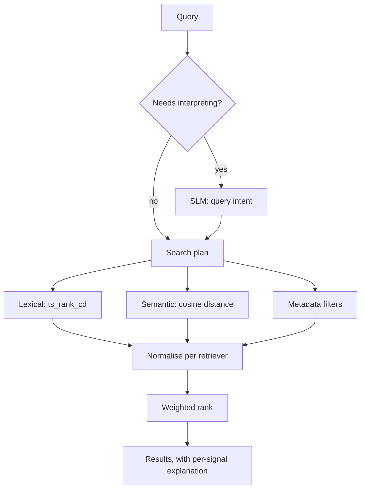
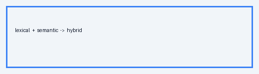

# Hybrid Retrieval

Lexical search and vector search fail in opposite directions. Lexical search misses anything phrased
differently from the query. Vector search returns things that are *about* the right subject while
missing the exact error string you pasted in.

Hybrid retrieval runs both and combines the results. The interesting part is the combination.

## Run both, then merge

Each retriever proposes candidates with its own score:

- Full text search, ranked by `ts_rank_cd` — see [[PostgreSQL Full Text Search]] by Anita Rao for
  why cover density rather than plain frequency.
- Vector similarity, ranked by cosine distance — see [[pgvector Similarity Search|the pgvector guide]]
  for the operator and index pairing.

A metadata retriever handles the third case: a query that is entirely filters ("everything by Anita
about postgres") and has no text to rank at all.

## Normalize before combining

This is the part that is easy to get wrong and hard to notice.

`ts_rank_cd` has **no fixed upper bound**. Cosine similarity is capped at **1**. Add them raw and
the lexical scale dominates every result, for reasons that have nothing to do with relevance. The
weights you configured are then decorative.

Scale each retriever's scores against *that retriever's own maximum for this query* before applying
any weight:

```
normalized = raw / max(raw for this retriever)
score      = w_lexical * lexical + w_semantic * semantic + boosts
```

Now a weight of 1.0 and 0.8 means what it says.

## The shape of it

Both retrievers run against the same query and propose candidates independently. Nothing merges
until each has scored on its own terms, because normalising before you know a retriever's own
maximum is what makes one scale dominate the other.



The dashed path matters more than it looks: a query the analyzer judges simple never reaches the
model at all, and one the model fails to interpret in time falls back to the same deterministic
parse. Retrieval does not depend on the model being available.



## Keep ranking deterministic

Given the same query, corpus and weights, the order must not change between requests. That means:

- No randomness, and no wall-clock input beyond a coarse recency decay.
- A stable tiebreaker — article id works — so equal scores do not reshuffle between pages.

Without this, pagination is quietly broken: page two can contain something you already saw on
page one.

## Explain the result

A raw score tells a human nothing. Keep the per-signal contributions and surface them as words —
"matched on text and topic" — so a reader can tell whether a result is the kind of thing they
wanted without opening it.

The retrieval strategy itself is a separate concern from *interpreting* the query, which is covered
in [[Query Understanding]].
